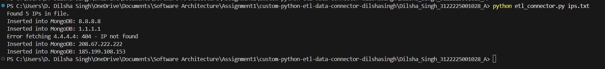
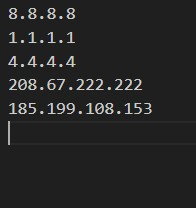
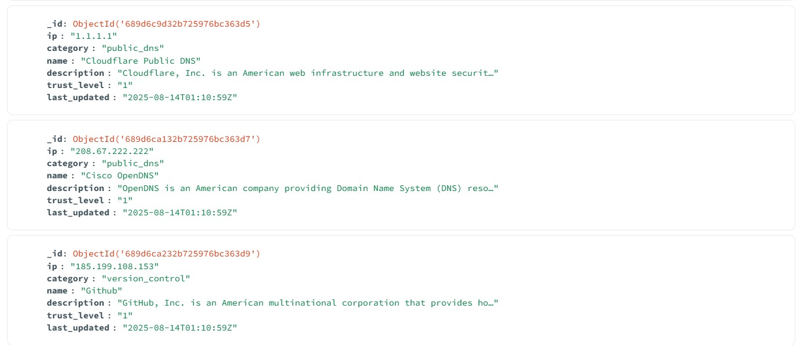

# Custom Python ETL Data Connector

## Overview

This project implements a **Python-based ETL (Extract, Transform, Load) pipeline** that integrates with the [GreyNoise API](https://www.greynoise.io/) to gather threat intelligence data for given IP addresses.  
It then transforms the retrieved data into a structured format and loads it into a **MongoDB** collection for storage and later analysis.

**Workflow:**

1. **Extract** → Reads IP addresses from a text file and queries the GreyNoise API.
2. **Transform** → Extracts key fields such as category, name, trust level, and last updated date.
3. **Load** → Inserts the cleaned data into a MongoDB collection.

---

## 📦 Requirements

- **Python** ≥ 3.8
- **MongoDB** (local instance or cloud service like Atlas)
- **GreyNoise API Key** ([create an account](https://www.greynoise.io/))

---

## ⚙️ Environment Setup

### 1. Clone the Repository

```bash
git clone https://github.com/yourusername/custom-python-etl-data-connector.git
cd custom-python-etl-data-connector/Dilsha_Singh_3122225001028_A
```

### 2. Install Dependencies

```bash
pip install -r requirements.txt
```

### 3. Configure Environment Variables

Create a `.env` file in the project directory:

```env
GREYNOISE_API_KEY=your_greynoise_api_key_here
MONGO_URI=your_mongo_uri
```

**Alternatively, use the provided template:**

```bash
cp ENV_TEMPLATE .env
# Then edit .env with your actual credentials
```

### 4. Setup MongoDB

- **Local MongoDB:** Ensure MongoDB is running on your localhost
- **MongoDB Atlas:** Replace `MONGO_URI` with your Atlas connection string

---

## How to Run

### 1. Prepare IP Address List

Add IP addresses to the `ips.txt` file (one IP per line):

```
8.8.8.8
1.1.1.1
192.168.1.1
10.0.0.1
```

### 2. Execute the ETL Pipeline

```bash
python etl_connector.py ips.txt
```

### 3. Monitor the Process

The script will display real-time progress:

- **Valid IPs** → Processed successfully
- **Invalid IPs** → Skipped with reason
- **Retries** → Automatic retry on API failures
- **Storage** → Confirmation of MongoDB insertion

---

## MongoDB Storage

### Database Structure

- **Database:** `database name`
- **Collection:** `collection name`

---

## Script Features

### Core Functionality

- **IP Validation** → Validates IPv4 format before processing
- **API Integration** → Seamless GreyNoise API communication
- **Data Transformation** → Cleans and structures raw API responses
- **MongoDB Storage** → Persistent storage with indexing support

### Error Handling

- **Retry Logic** → Up to 3 attempts for failed API calls with exponential backoff
- **404 Handling** → Gracefully skips IPs not found in GreyNoise dataset
- **Rate Limiting** → Respects API rate limits with built-in delays
- **Connection Management** → Automatic MongoDB connection handling

### Monitoring & Logging

- **Progress Tracking** → Real-time processing status updates
- **Error Reporting** → Detailed error messages for troubleshooting
- **Success Metrics** → Summary of processed vs. failed records

---

## Screenshots

### Terminal



### IP addresses file



### Database Storage



---
